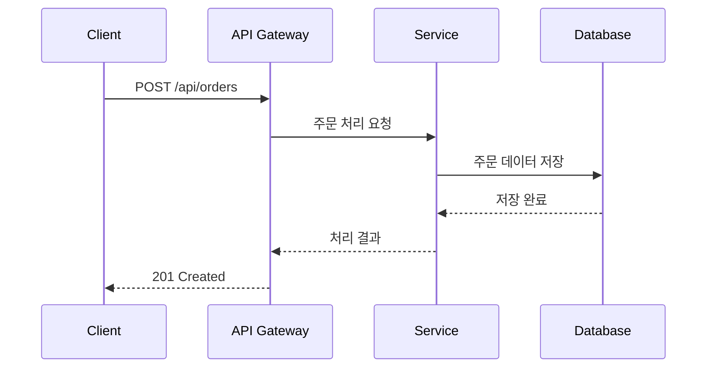
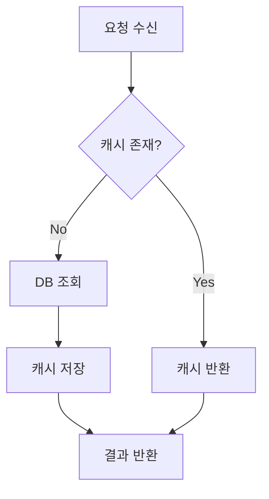
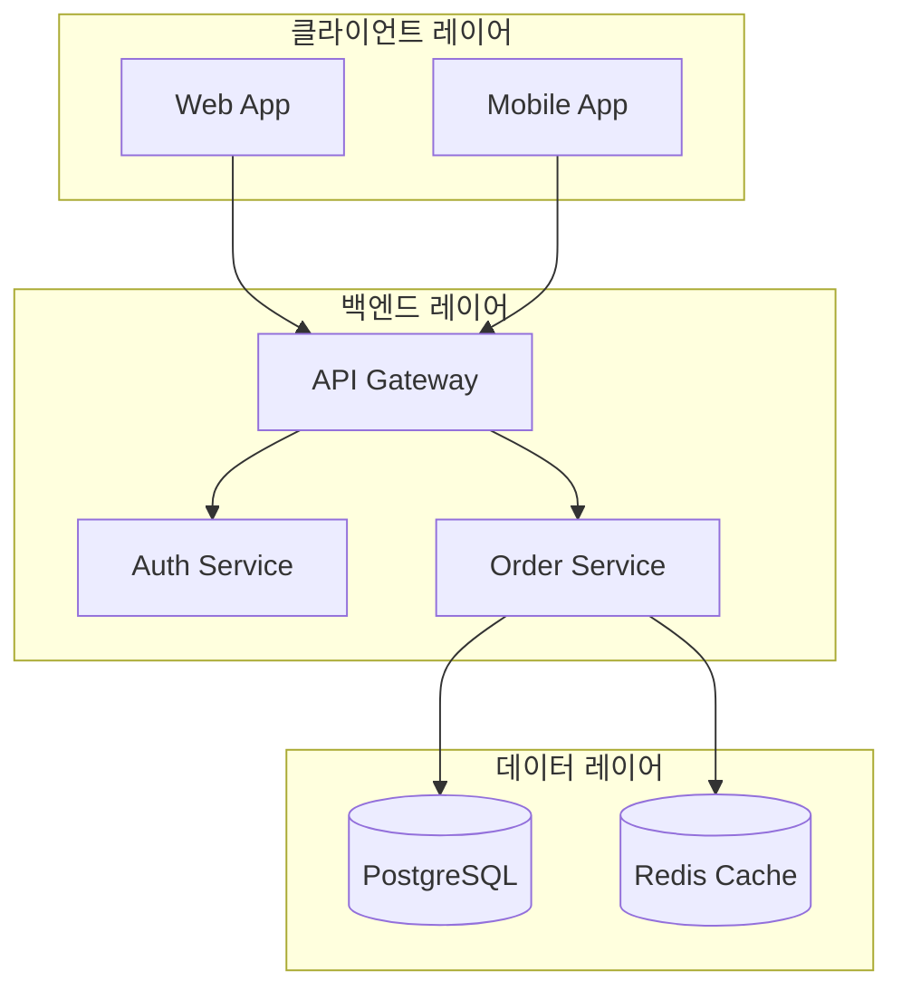

# 블로그 작성 스타일 가이드

> 대한민국 주요 IT 기업 기술 블로그(네이버 D2, 카카오, 토스, 우아한형제들, LINE, 당근, 뱅크샐러드, 쿠팡, 요기요 등)의 공통 패턴을 분석하여 정리한 가이드입니다.

---

## 1. 톤과 문체

### 기본 원칙
- **명확함(Clear)**: 모호하지 않은 표현, 한 문장에 하나의 의미만 담기 (토스 원칙)
- **간결함(Concise)**: 불필요한 수식어 제거, 핵심 정보만 전달 (요기요 원칙)
- **친근함(Casual)**: 독자와 대화하듯 자연스러운 톤 유지 (우아한형제들 스타일)
- **일관성(Consistent)**: 용어와 표현을 통일, 같은 개념에 다른 단어 사용 금지 (토스 원칙)
- **공감(Empathetic)**: 독자의 어려움에 공감하며, 함께 해결해나가는 느낌 (뱅크샐러드 스타일)

### 경어 스타일
- 기본: `~입니다`/`~합니다` 체 (존댓말)
- `~해요`/`~이에요` 체와 혼용 가능 (보다 부드러운 톤이 필요할 때)
- 독자 지칭: "여러분" 또는 "우리" — 일체감을 형성
- 코드 설명 시: "~해봅시다", "~해보겠습니다" — 함께 진행하는 느낌

### 문장 작성 규칙
- 한 문장은 60자 이내가 이상적 (요기요 UX Writing 기준)
- 이중 부정 사용 금지 ("불가능하지 않은" → "가능한")
- 수동태보다 능동태 우선 ("처리됩니다" → "처리합니다")
- 어려운 개념은 비유나 일상 사례로 설명
- 영문 기술 용어는 처음 등장 시 한글 병기: "Lazy Loading(지연 로딩)"

---

## 2. 저자 소개 (Author Introduction)

> LINE, 카카오, 우아한형제들 등 대부분의 기술 블로그에서 글 서두에 저자를 소개합니다.

### 형식
```
안녕하세요. [팀/부서명]에서 [역할]을 담당하고 있는 [이름]입니다.
[현재 맡고 있는 업무나 프로젝트 한 줄 소개]
```

### 예시
```
안녕하세요. 배달의민족 주문플랫폼팀에서 백엔드 개발을 하고 있는 김지원입니다.
주로 주문 처리 시스템의 성능 최적화와 안정성 개선을 담당하고 있습니다.
```

---

## 3. 제목 작성

### 원칙
- SEO 핵심 키워드를 앞쪽에 배치
- 구체적인 문제/해결책 또는 기술 주제를 명시
- 30~50자 범위 권장
- 대괄호로 기술 스택 표기 가능: `[Spring Boot]`, `[React]`

### 좋은 제목 패턴
| 패턴 | 예시 |
|------|------|
| [기술] 문제 해결 | `[Spring Boot] JPA N+1 문제 해결하기 - fetch join과 @EntityGraph 비교` |
| 기술 적용 경험 | `Kafka 도입으로 주문 처리 성능 3배 개선한 이야기` |
| How-to 가이드 | `Kubernetes 환경에서 무중단 배포 파이프라인 구축하기` |
| 의사결정 과정 | `MSA 전환 시 API Gateway를 직접 만든 이유` |
| 분석/비교 | `Redis vs Memcached: 대규모 트래픽 캐싱 전략 비교` |

### 피해야 할 제목
- 너무 포괄적: "개발 이야기", "기술 정리"
- 과장: "완벽 가이드", "모든 것"
- 모호: "이것저것 해봤습니다"

---

## 4. 글 구조

> 네이버 D2, 카카오, 우아한형제들, 뱅크샐러드 등 대부분의 기술 블로그가 공유하는 공통 구조입니다.

### 기본 구조 (5단계)

#### 1단계: 배경과 문제 정의 (Background & Problem)
- 이 글을 쓰게 된 맥락과 동기 설명
- 독자가 공감할 수 있는 구체적인 이슈나 상황 제시
- 에러 메시지, 성능 수치, 장애 증상 등 구체적 근거 포함
- "왜 이 문제가 발생하는가"에 대한 기술적 배경 설명

```markdown
## 배경
저희 팀은 하루 100만 건의 주문을 처리하는 시스템을 운영하고 있습니다.
최근 트래픽이 급증하면서 다음과 같은 문제가 발생했습니다.

- 평균 응답 시간: 200ms → 2,000ms
- DB 커넥션 풀 고갈 빈도: 주 1회 → 일 3회
```

#### 2단계: 기술적 접근과 의사결정 (Approach & Decision)
- 문제 해결을 위해 검토한 선택지들을 나열
- 각 선택지의 장단점 비교 (표 형식 권장)
- 최종 선택의 이유와 근거 설명
- 시도했다가 실패한 방법도 솔직하게 기록 (뱅크샐러드 TechSpec 문화)

```markdown
## 해결 방법 탐색

| 방안 | 장점 | 단점 | 선택 여부 |
|------|------|------|-----------|
| 캐시 레이어 추가 | 빠른 적용, 효과 큼 | 정합성 이슈 | ✅ 채택 |
| DB 샤딩 | 근본적 해결 | 적용 비용 높음 | ❌ 보류 |
| 읽기 전용 복제본 | 안정적 | 지연 발생 가능 | ⏳ 추후 검토 |
```

#### 3단계: 구현 세부사항 (Implementation)
- 핵심 코드와 설정을 단계별로 제시
- 코드 블록마다 "무엇을 하는 코드인지" 한글 설명 선행
- Before/After 비교 형식 적극 활용
- 주요 라인에 한글 주석 포함

#### 4단계: 결과 및 검증 (Results & Verification)
- 개선 전후 수치 비교 (표, 그래프 활용)
- 테스트 방법이나 검증 커맨드 제공
- 모니터링 대시보드 캡처나 로그 예시 포함
- 부작용이나 트레이드오프도 솔직하게 공유

```markdown
## 결과

| 지표 | 개선 전 | 개선 후 | 변화 |
|------|---------|---------|------|
| 평균 응답 시간 | 2,000ms | 150ms | 92% 감소 |
| DB 커넥션 사용률 | 95% | 40% | 55%p 감소 |
| 일 장애 건수 | 3건 | 0건 | 100% 해결 |
```

#### 5단계: 마무리 및 회고 (Conclusion & Retrospective)
- 전체 과정을 한 문단으로 요약
- 배운 점과 인사이트 공유
- 향후 계획이나 추가 개선 방향 제시
- 관련 참고 자료 및 공식 문서 링크
- 독자에게 의견을 구하거나 피드백 요청

---

### 글 유형별 구조 변형

#### TIL (Today I Learned)
```
1. 한 줄 요약 (오늘 배운 핵심)
2. 배경 (어떤 상황에서 배웠는지)
3. 핵심 내용 (코드/개념 설명)
4. 정리 (기억할 포인트)
```

#### Tutorial (튜토리얼)
```
1. 완성 결과 미리보기 (동기 부여)
2. 사전 준비사항 (Prerequisites)
3. 단계별 구현 (Step-by-step)
4. 전체 코드 (완성본)
5. 다음 단계 제안
```

#### Deep-dive (심층 분석)
```
1. 도입 (왜 깊게 파야 하는가)
2. 개념 설명 (이론적 배경)
3. 내부 동작 원리 (소스 코드 레벨 분석)
4. 실험 및 벤치마크
5. 실무 적용 가이드
6. 참고 문헌
```

#### Troubleshooting (문제 해결)
```
1. 증상 (에러 메시지, 로그)
2. 환경 정보 (버전, OS, 설정)
3. 원인 분석 (디버깅 과정)
4. 해결 방법 (핵심 수정 사항)
5. 재발 방지책
```

---

## 5. 코드 작성 가이드

### 코드 블록 규칙
- 언어를 반드시 명시: ` ```typescript `, ` ```python `, ` ```yaml ` 등
- 코드 앞에 "이 코드는 ~하는 역할입니다" 한 줄 설명 추가
- 주요 라인에 한글 주석으로 핵심 포인트 강조
- 긴 코드는 핵심 부분만 발췌 — 전체 코드는 GitHub 링크로 제공

### Before/After 패턴
```markdown
**Before (개선 전)**
// N+1 쿼리 발생 코드
...

**After (개선 후)**
// fetch join으로 N+1 문제 해결
...
```

### 코드 설명 원칙
- "무엇(What)"보다 "왜(Why)" 중심으로 설명
- 해당 코드가 전체 흐름에서 어디에 위치하는지 맥락 제공
- 실행 가능한 완전한 코드 제공을 원칙으로 함

---

## 6. 시각 자료 가이드 (최우선 필수 - 절대 생략 금지)

> 뱅크샐러드의 TechSpec, 카카오의 기술 문서 템플릿에서 다이어그램 활용을 강조합니다.
> **⚠️ 시각 자료는 선택이 아니라 최우선 필수입니다. 시각적 요소가 부족한 글은 미완성입니다.**

### 시각 요소 수량 기준 (반드시 준수)

| 글 유형 | 최소 시각 요소 수 | 권장 시각 요소 수 | Mermaid 다이어그램 최소 |
|---------|-------------------|-------------------|------------------------|
| TIL | 3개 | 4~5개 | 1개 |
| Tutorial | 5개 | 7~10개 | 2개 |
| Deep-dive | 7개 | 10~15개 | 3개 |
| Troubleshooting | 4개 | 6~8개 | 2개 |

> **🔥 핵심**: 위 수량은 최소 기준입니다. 시각 요소에는 Mermaid 다이어그램, 표(Table), 콜아웃 블록, Before/After 비교 블록이 모두 포함됩니다. 글이 길수록 더 많은 시각 요소를 포함하세요.

### 시각 요소 필수 배치 규칙
- **글 전체**: 위 수량 기준표를 반드시 충족
- **모든 주요 섹션(H2)**: 최소 1개 이상의 시각적 요소 포함 (텍스트만으로 구성된 섹션 금지)
- **2단계 이상 구조가 있는 섹션**: 반드시 다이어그램 또는 플로우차트 포함
- **비교/선택 내용**: 반드시 표(Table) 형식으로 정리
- **결과/성과 섹션**: 수치 비교 표 또는 Before/After 블록 필수
- **핵심 개념 설명**: 다이어그램 또는 시각적 보조 자료 필수
- **코드 변경 설명**: Before/After 코드 비교 블록 필수
- **프로세스/흐름 설명**: Mermaid 다이어그램 필수 (텍스트 나열 금지)

### 시각 요소 우선순위 (텍스트보다 시각 요소를 먼저 배치)
1. **다이어그램 먼저, 설명은 나중에**: 개념이나 흐름을 설명할 때 Mermaid 다이어그램을 먼저 보여주고, 그 아래에 텍스트 설명을 추가
2. **표 먼저, 풀어쓰기는 나중에**: 비교나 목록 정보는 표로 먼저 정리하고, 필요시 텍스트로 보충
3. **코드는 항상 시각 요소와 함께**: 코드 블록 앞뒤에 콜아웃, 다이어그램, 또는 Before/After 블록 배치

### Mermaid 다이어그램 (적극 활용)

Mermaid 문법으로 작성하면 코드로서의 다이어그램을 유지할 수 있습니다. **가능한 모든 흐름과 구조를 Mermaid로 시각화하세요.**

#### 권장 다이어그램 유형과 활용
| 유형 | Mermaid 타입 | 활용 장면 |
|------|-------------|-----------|
| 시퀀스 다이어그램 | `sequenceDiagram` | API 호출 흐름, 서비스 간 통신, 요청/응답 흐름 |
| 플로우차트 | `flowchart TD/LR` | 의사결정 과정, 데이터 처리 흐름, 알고리즘 |
| 아키텍처 다이어그램 | `flowchart TD` + subgraph | 시스템 전체 구조, 인프라 구성, 레이어 구조 |
| 상태 다이어그램 | `stateDiagram-v2` | 상태 전이, 생명주기, 프로세스 단계 |
| ERD | `erDiagram` | DB 설계, 테이블 관계, 데이터 모델 |
| 클래스 다이어그램 | `classDiagram` | 객체 관계, 디자인 패턴, 인터페이스 |
| 간트 차트 | `gantt` | 타임라인, 프로젝트 진행 과정 |
| 파이 차트 | `pie` | 비율, 분포, 구성 비교 |

#### Mermaid 예시 (시퀀스 다이어그램)
````markdown

````

#### Mermaid 예시 (플로우차트)
````markdown

````

#### Mermaid 예시 (아키텍처 - subgraph 활용)
````markdown

````

### 표(Table) 활용 가이드

표는 정보를 압축적으로 전달하는 가장 효과적인 방법입니다.

#### 필수 사용 장면
- **기술 비교**: 라이브러리, 프레임워크, 접근 방식 비교
- **장단점 분석**: 각 선택지의 장점/단점
- **설정값 설명**: 환경 변수, 설정 옵션
- **성능 비교**: Before/After 수치
- **상태 코드, 에러 코드**: API 응답 코드 설명

#### 표 작성 팁
- 이모지로 상태 표시: ✅ 채택, ❌ 미채택, ⚠️ 주의, ⏳ 보류, 🔥 핵심
- 수치 변화에 화살표 활용: ↑ 증가, ↓ 감소, → 유지

### 콜아웃/강조 블록

> [!NOTE] / > [!TIP] / > [!WARNING] / > [!IMPORTANT] 형식 또는 인용 블록(>)을 적극 활용하세요.

#### 활용 패턴
```markdown
> **💡 핵심 포인트**: 여기서 가장 중요한 것은...

> **⚠️ 주의사항**: 이 설정을 변경하면...

> **📝 참고**: 공식 문서에 따르면...

> **🔥 성능 팁**: 이 방법을 사용하면 응답 시간을 50% 줄일 수 있습니다.
```

### Before/After 비교 블록

코드나 결과를 비교할 때 반드시 Before/After 형식을 사용하세요.

```markdown
**Before (개선 전)** ❌
// 문제가 있는 코드

**After (개선 후)** ✅
// 개선된 코드
```

### 시각 요소 자가 점검 체크리스트 (글 완성 전 반드시 확인)
- [ ] 글 유형별 최소 시각 요소 수량 기준을 충족했는가?
- [ ] 모든 H2 섹션에 최소 1개 이상의 시각 요소가 있는가?
- [ ] 프로세스/흐름 설명에 Mermaid 다이어그램을 사용했는가?
- [ ] 비교/분석 내용을 표로 정리했는가?
- [ ] 코드 변경 시 Before/After 블록을 사용했는가?
- [ ] 핵심 포인트에 콜아웃 블록(💡, ⚠️, 🔥, 📝)을 사용했는가?
- [ ] 다이어그램 먼저 → 텍스트 나중에 순서를 지켰는가?

### 이미지 및 기타 규칙
- 모든 다이어그램에 제목과 간단한 설명 추가
- 스크린샷에는 핵심 영역을 강조(하이라이트, 화살표)
- 성능 비교 시 그래프/차트 활용
- 긴 텍스트보다 시각적 요소로 먼저 설명하고 텍스트로 보충
- 각 주요 섹션 시작 시 해당 섹션의 핵심을 요약하는 시각 요소 배치
- **3줄 이상의 연속 텍스트 단락 사이에는 시각 요소를 삽입하여 가독성을 높이세요**

---

## 7. 금지 표현

### 독자를 배제하는 표현
- "간단히", "쉽게", "그냥" → 독자에게 압박감을 줄 수 있음
- "당연히", "누구나 아는", "기본 중의 기본" → 초보자를 배제
- "최고의", "완벽한", "궁극의" → 과장된 표현

### 모호한 표현
- "적절히 설정하면 됩니다" → 구체적인 값과 이유를 제시
- "상황에 따라 다릅니다" → 어떤 상황에서 어떻게 다른지 명시
- "잘 알려진 방법입니다" → 출처와 레퍼런스를 제공

### 비능동적 표현 (요기요 원칙)
- "처리되었습니다" → "처리했습니다"
- "확인이 필요합니다" → "확인해 주세요" / "확인하겠습니다"
- "문제가 발생될 수 있습니다" → "문제가 발생할 수 있습니다"

---

## 8. SEO 고려사항

### 키워드 배치
- 제목(H1)에 핵심 키워드를 앞쪽에 배치
- 소제목(H2, H3)에 검색 키워드 자연스럽게 포함
- 첫 문단(150자 이내)을 메타 설명으로 활용 가능하게 작성
- 이미지 alt 텍스트에 키워드 포함

### 내부 링크
- 관련 이전 글에 자연스럽게 링크 연결
- 시리즈 글이면 이전/다음 편 안내

---

## 9. 타겟 독자

### 기본 대상
- 1~3년차 주니어 백엔드/프론트엔드 개발자
- 해당 기술 스택의 기본 개념은 알지만 실무 적용 경험이 부족한 독자

### 독자 레벨별 작성 가이드
| 레벨 | 설명 | 작성 방식 |
|------|------|-----------|
| 입문 | 기본 개념 학습 중 | 용어 정의부터, 모든 단계 상세 설명 |
| 주니어 | 기본은 아는 상태 | "왜"에 집중, 실무 맥락 제공 |
| 미들 | 실무 경험 있음 | 의사결정 과정, 트레이드오프 분석 |
| 시니어 | 깊은 이해 보유 | 벤치마크, 내부 구현 분석, 아키텍처 |

### 기본 가정
- 해당 언어의 기본 문법은 알고 있다고 가정
- 프레임워크 설치, 프로젝트 초기 세팅은 사전 준비사항으로 별도 안내
- 심화 개념은 인라인 설명 + 참고 링크 병행

---

## 10. 분량 가이드

| 유형 | 글자 수 | 예상 읽기 시간 |
|------|---------|----------------|
| TIL | 10,000~15,000자 | 30분 |
| Tutorial | 25,000~30,000자 | 1시간 |
| Deep-dive | 50,000~60,000자 | 2시간 |
| Troubleshooting | 10,000~15,000자 | 30분 |
| 경험 공유/회고 | 25,000~30,000자 | 1시간 |

> **참고**: 기술 블로그의 평균 읽기 속도는 분당 약 500자(기술 콘텐츠 기준)로 산정했습니다. 글이 길어질 경우 목차(TOC)를 반드시 포함하고, 필요시 시리즈로 분할하는 것을 권장합니다.

---

## 11. 카테고리 (Categories)

| 카테고리 | 설명 | 사용 예시 |
|---------|------|----------|
| Development | 기능 개발, 코드 작성 | 새 기능 구현, 리팩토링 |
| Troubleshooting | 문제 해결 과정 | 버그 수정, 에러 해결, 장애 대응 |
| Tutorial | 가이드/튜토리얼 | 설정 방법, 사용법, 입문 가이드 |
| Review | 리뷰/회고 | 라이브러리 리뷰, 프로젝트 회고, 기술 선택 후기 |
| TIL | Today I Learned | 짧은 학습 기록, 새로 알게 된 사실 |
| DevOps | 인프라/배포/운영 | CI/CD, Docker, Kubernetes, 모니터링 |
| Architecture | 아키텍처/설계 | 시스템 설계, 패턴, MSA, 이벤트 기반 |
| Performance | 성능 최적화 | 응답 속도 개선, 메모리 최적화, 쿼리 튜닝 |
| Culture | 개발 문화/협업 | 코드 리뷰 문화, 팀 워크플로우, 온보딩 |

---

## 12. 태그 (Tags)

### 프로그래밍 언어
- `java`, `kotlin`, `python`, `javascript`, `typescript`
- `go`, `rust`, `ruby`, `swift`, `c++`

### 프레임워크/라이브러리
- `spring`, `spring-boot`, `jpa`, `hibernate`, `querydsl`
- `react`, `vue`, `nextjs`, `nestjs`, `express`
- `django`, `flask`, `fastapi`

### 인프라/도구
- `docker`, `kubernetes`, `aws`, `gcp`, `azure`
- `github-actions`, `jenkins`, `terraform`, `ansible`
- `nginx`, `kafka`, `rabbitmq`, `elasticsearch`

### 데이터베이스
- `mysql`, `postgresql`, `mongodb`, `redis`, `dynamodb`

### 관심 분야
- `ai`, `llm`, `ml`, `data-engineering`
- `msa`, `ddd`, `event-driven`, `cqrs`
- `testing`, `tdd`, `monitoring`, `observability`

### 기타
- `git`, `linux`, `mac`, `vscode`, `intellij`
- `jekyll`, `github-pages`, `blog`
- `claude`, `chatgpt`, `mcp`

### 태그 사용 규칙
1. **소문자 사용**: `Spring` → `spring`
2. **하이픈 연결**: `GitHub Actions` → `github-actions`
3. **영어 사용**: 한글 태그 지양
4. **구체적 태그**: `java` + `spring-boot` (둘 다 사용)
5. **최대 개수**: 포스트당 3~7개 권장

---

## 13. 참고 자료 (References) 작성법

### 형식
- 글 말미에 "참고 자료" 또는 "References" 섹션으로 분리
- 공식 문서, GitHub 저장소, 관련 기술 블로그 순서로 배치
- 링크가 끊어지지 않도록 공식 문서 우선

```markdown
## 참고 자료
- [Spring Boot 공식 문서 - Caching](https://docs.spring.io/...)
- [Redis Documentation](https://redis.io/docs/)
- [우아한형제들 기술 블로그 - 캐시 전략](https://techblog.woowahan.com/...)
```

---

## 14. 금지 사항

- 검증되지 않은 코드 예시 제공 금지
- 라이선스 문제가 있는 코드 복사 금지
- 특정 서비스/제품의 과도한 홍보 금지
- 오래된 버전 정보를 최신인 것처럼 작성 금지
- 타사 기술 블로그 내용을 출처 없이 가져오기 금지
- 확인되지 않은 성능 수치 제시 금지

---

## 15. 영감을 받은 기술 블로그

> 각 블로그의 강점을 참고하여 자신만의 스타일을 발전시키세요.

| 블로그 | 강점 | 참고 포인트 |
|--------|------|-------------|
| 네이버 D2 | 기술적 깊이와 권위 | 대규모 시스템 분석, 학술적 접근 |
| 카카오 기술 블로그 | 실용적 사례 중심 | 서비스별 실무 경험 공유 |
| 토스 기술 블로그 | 명확한 글쓰기 원칙 | 8가지 글쓰기 원칙, UX Writing |
| 우아한형제들 기술 블로그 | 따뜻한 톤, 문화 공유 | 개발 문화와 기술을 함께 전달 |
| LINE Engineering | 체계적 문서화 | TechSpec → 블로그 전환 프로세스 |
| 당근 기술 블로그 | 커뮤니티 친화적 | 개발자-디자이너 협업 이야기 |
| 뱅크샐러드 기술 블로그 | TechSpec 문화 | 의사결정 과정의 투명한 공유 |
| 쿠팡 Engineering | 글로벌 스케일 | 대규모 이커머스 기술 과제 |
| 요기요 기술 블로그 | UX Writing 적용 | 간결하고 능동적인 문장 |
