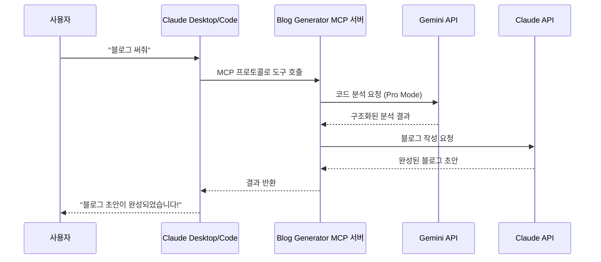
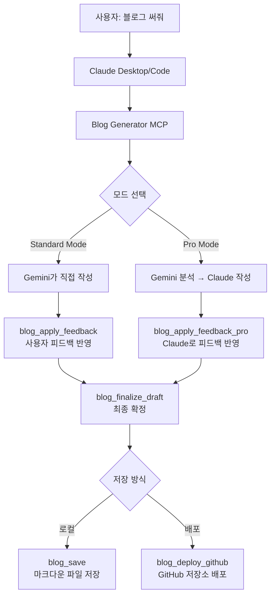
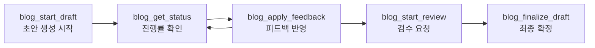

# Blog Generator MCP 개발기: "블로그 써줘" 한 마디로 기술 블로그가 만들어지기까지

코드를 커밋하면 개발일지가 자동으로 생성된다면 어떨까요? MCP(Model Context Protocol) 서버를 만들어 Gemini와 Claude를 조합한 블로그 자동 생성 시스템을 구축한 과정을 공유합니다.

---

## 문제 상황: 기술 블로그, 쓰고 싶지만 쓸 시간이 없다

기술 블로그를 꾸준히 쓰고 싶었습니다. 하지만 코드를 작성하고, 리뷰하고, 배포하다 보면 하루가 끝나 있었습니다. 블로그 글 하나를 쓰려면 코드를 다시 들여다보고, 맥락을 정리하고, 서사를 만들어야 합니다. 코드 작성과는 전혀 다른 종류의 에너지가 필요한 작업이었습니다.

그러던 중 **MCP(Model Context Protocol)**라는 것을 알게 되었고, "코드를 커밋하면 자동으로 개발일지가 생성되면 좋겠다"는 아이디어가 떠올랐습니다. 그렇게 시작된 것이 **Blog Generator MCP** — AI를 활용한 기술 블로그 자동 생성 MCP 서버입니다.

> 참고: 이 블로그 포스트는 Blog Generator MCP 자체를 사용해서 생성되었습니다. 자기 자신의 개발기를 자기 자신이 쓰는 셈입니다.

---

## MCP(Model Context Protocol)란 무엇인가요?

본격적인 개발기에 앞서, MCP가 무엇인지 먼저 설명하겠습니다.

여러분이 USB-C 케이블 하나로 충전기, 모니터, 외장 하드를 모두 연결하듯이, **MCP는 AI 모델과 다양한 외부 서비스를 하나의 표준 프로토콜로 연결하는 기술**입니다.

좀 더 구체적으로 말하면, MCP는 **Anthropic이 만든 오픈 프로토콜**로, LLM 애플리케이션(Claude Desktop, Claude Code 등)이 외부 **도구(Tool)**와 **데이터 소스**에 접근할 수 있게 해줍니다.

MCP 서버를 한 번 만들어두면 Claude Desktop에서 "도구"로 바로 사용할 수 있습니다. 별도의 웹 UI나 REST API를 만들 필요가 없습니다. 사용자가 "블로그 써줘"라고 말하면, Claude가 알아서 적절한 MCP 도구를 호출합니다.



이것이 Blog Generator MCP를 만들게 된 핵심 동기입니다. REST API와 프론트엔드를 따로 만들 필요 없이, Claude 안에서 자연어로 동작하는 도구를 만들 수 있다는 점이 매력적이었습니다.

---

## 전체 아키텍처: 10개의 MCP 도구로 이루어진 블로그 파이프라인

먼저 완성된 프로젝트의 전체 구조를 보겠습니다.



프로젝트의 디렉토리 구조는 다음과 같습니다:

```text
src/
├── index.ts              # CLI 엔트리포인트 (Commander)
├── server.ts             # MCP 서버 - 10개 도구 등록
├── types.ts              # 타입 + Zod 스키마 (입력 검증)
├── services/
│   ├── gemini.ts         # Gemini API (초안 생성, 코드 분석)
│   ├── anthropic.ts      # Claude API (Pro Mode 글 작성)
│   ├── database.ts       # SQLite 상태 관리 (sql.js)
│   ├── taskRunner.ts     # 백그라운드 작업 실행
│   ├── env.ts            # 환경변수 관리
│   └── github.ts         # GitHub 배포 (Octokit)
├── tools/                # 10개 MCP 도구 각각의 구현 파일
└── transports/
    ├── stdio.ts          # Claude Desktop용 표준입출력
    └── http.ts           # HTTP 서버용 (팀 공유, 멀티유저)
```

하지만 처음부터 이런 구조는 아니었습니다. 7번의 커밋을 거쳐 여기에 도달했습니다. 각 버전별로 어떤 문제를 해결했고, 어떤 결정을 내렸는지 순서대로 살펴보겠습니다.

---

## v1.0 — 첫 걸음: 기본적인 블로그 생성기

첫 버전은 가장 작은 범위에서 시작했습니다. Gemini API로 블로그 초안을 생성하고, 로컬에 저장하거나 GitHub에 배포하는 4개의 도구만 만들었습니다.

MCP 서버의 핵심은 `server.tool()`로 도구를 등록하는 것입니다. **도구 하나가 곧 사용자가 호출할 수 있는 기능 하나**에 해당합니다:

```typescript
// server.ts - MCP 도구 등록
import { McpServer } from "@modelcontextprotocol/sdk/server/mcp.js";

const server = new McpServer({
  name: "blog-generator-mcp",
  version: "1.0.0"
});

// 각 도구를 이름, 설명, 입력 스키마, 핸들러 함수로 등록
registerGenerateDraftTool(server);  // 초안 생성
registerReviewPostTool(server);     // 검수
registerSaveBlogTool(server);       // 저장
registerDeployGithubTool(server);   // GitHub 배포
```

> **도구 등록이란?** Claude Desktop에서 사용할 수 있는 "기능"을 MCP 서버에 등록하는 것입니다. 위 코드에서 `registerGenerateDraftTool(server)`를 호출하면, Claude가 "초안 생성" 기능을 인식하고 필요할 때 자동으로 호출합니다.

v1.0은 stdio 트랜스포트(표준 입출력, 즉 터미널 기반 통신)만 지원했고, API 키는 환경변수로 받았습니다. 4가지 입력 타입(`keyword`, `code`, `memo`, `git_push`)과 4가지 스타일(`tutorial`, `til`, `deep-dive`, `troubleshooting`)을 지원했습니다.

**v1.0의 한계**: 한 번 생성하면 끝이었습니다. AI가 만든 글이 마음에 안 들면? 처음부터 다시 생성해야 했습니다. 사람이 글을 쓸 때처럼 "여기를 이렇게 고쳐줘"라고 말할 수 없었습니다.

---

## v2.0 — 인터랙티브 워크플로우: 피드백 루프 도입

### 해결해야 할 문제

v1.0을 쓰면서 느낀 것은, **한 번에 만족스러운 글을 기대하는 것은 비현실적**이라는 점이었습니다. 사람이 글을 쓸 때도 초안 → 수정 → 수정 → 완성의 과정을 거칩니다. AI도 마찬가지여야 했습니다.

### 해결 방식: 5단계 워크플로우

v2.0의 핵심 변화는 **인터랙티브 워크플로우**입니다. 사용자가 AI와 대화하듯 글을 다듬어 나갈 수 있습니다:



1. `blog_start_draft` → 백그라운드에서 초안 생성 시작
2. `blog_get_status` → 진행률 폴링 (0~100%)
3. `blog_apply_feedback` → "이 부분을 이렇게 고쳐줘" 피드백 반영
4. `blog_start_review` → 검수 (정확성/가독성/SEO 점검)
5. `blog_finalize_draft` → 최종 확정

이 워크플로우를 구현하기 위해 두 가지 큰 기술적 결정이 필요했습니다.

### 기술적 결정 1: sql.js(WASM SQLite)로 상태 관리

블로그 생성은 수십 초가 걸리는 작업입니다. 동기적으로 처리하면 Claude Desktop이 응답 대기 상태로 멈춰버립니다. 따라서 **비동기 처리 + 상태 저장**이 필요했습니다.

여러 가지 방법을 고민했습니다:

| 방법 | 장점 | 단점 |
|------|------|------|
| 메모리 저장 | 구현이 빠름 | 서버 재시작 시 데이터 소실 |
| 파일 기반 (JSON) | 외부 의존성 없음 | 동시 접근 문제, 느림 |
| **sql.js (WASM SQLite)** | **외부 DB 불필요 + 영속성** | WASM 번들 크기 |
| better-sqlite3 | 네이티브 성능 | C++ 바인딩 설치 필요 |

**sql.js**를 선택했습니다. WASM 기반으로 별도의 데이터베이스 서버 없이 순수 JavaScript만으로 SQLite를 실행할 수 있습니다. `npx blog-generator-mcp` 한 줄로 실행 가능해야 했기에, 외부 의존성을 최소화하는 것이 중요했습니다.

```typescript
// database.ts - 작업 상태 관리 테이블
const SCHEMA = `
  CREATE TABLE IF NOT EXISTS tasks (
    id TEXT PRIMARY KEY,           -- 고유 작업 ID
    type TEXT NOT NULL,            -- 'draft', 'review' 등 작업 유형
    status TEXT NOT NULL DEFAULT 'pending',  -- 'pending' | 'in_progress' | 'completed' | 'failed'
    progress INTEGER DEFAULT 0,    -- 진행률 (0~100)
    input TEXT NOT NULL,           -- 사용자 입력 (JSON)
    result TEXT,                   -- 생성 결과 (블로그 본문)
    history TEXT DEFAULT '[]',     -- 피드백 히스토리 (JSON 배열)
    error TEXT,                    -- 에러 메시지
    created_at TEXT DEFAULT (datetime('now')),
    updated_at TEXT DEFAULT (datetime('now'))
  );
`;
```

여기서 `history` 컬럼이 핵심입니다. 피드백을 줄 때마다 이전 버전이 히스토리에 쌓여서, 수정 과정을 추적할 수 있습니다.

### 기술적 결정 2: Stateless HTTP 트랜스포트 추가

Claude Desktop용 stdio 트랜스포트(터미널 기반 통신)만으로는 팀에서 공유하기 어려웠습니다. 여러 사용자가 동시에 접속할 수 있는 HTTP 방식이 필요했습니다.

Express 기반 HTTP 트랜스포트를 추가하되, **완전한 Stateless(무상태) 설계**를 택했습니다:

```typescript
// Before: stdio 트랜스포트만 지원 (v1.0)
import { StdioServerTransport } from "@modelcontextprotocol/sdk/server/stdio.js";
const transport = new StdioServerTransport();
await server.connect(transport);

// After: HTTP 트랜스포트 추가 (v2.0) — 매 요청마다 새로운 transport 생성
// transports/http.ts
app.post("/mcp", async (req, res) => {
  const transport = new StreamableHTTPServerTransport({
    sessionIdGenerator: undefined,  // 세션을 사용하지 않음
    enableJsonResponse: true
  });
  await server.connect(transport);
  await transport.handleRequest(req, res, req.body);
});
```

> **Stateless란?** HTTP 서버가 이전 요청의 정보를 기억하지 않는 설계입니다. 모든 상태는 SQLite 데이터베이스에 저장하고, HTTP 서버 자체는 상태를 갖지 않습니다. 이렇게 하면 서버 인스턴스를 여러 개 띄워도 문제없이 동작합니다.

### Zod 스키마: 입력 검증이 곧 사용자 인터페이스

MCP SDK는 **Zod**(TypeScript용 스키마 검증 라이브러리)를 네이티브로 지원합니다. Zod 스키마를 정의하면 그것이 곧 도구의 파라미터 명세가 됩니다. Claude가 이 스키마를 읽고, 사용자의 의도에 맞게 어떤 파라미터를 전달해야 하는지 판단합니다.

```typescript
// types.ts - Zod 스키마 = 사용자 인터페이스
import { z } from "zod";

export const StartDraftInputSchema = z.object({
  input_type: z.enum(["keyword", "code", "memo", "git_push"])
    .describe("입력 유형"),                    // ← Claude가 읽는 설명
  content: z.string().min(1).max(50000)
    .describe("블로그 글 생성에 사용할 입력 내용"),
  style: z.enum(["tutorial", "til", "deep-dive", "troubleshooting"])
    .default("tutorial")
    .describe("블로그 글 스타일"),
  model: z.nativeEnum(GeminiModel)
    .default(GeminiModel.FLASH)
    .describe("사용할 Gemini 모델"),
  instructions: z.string().optional()
    .describe("상세 작성 지침 (톤, 구조, 타겟 독자 등)"),
}).strict();
```

여기서 `.describe()`가 핵심입니다. 이 설명을 Claude가 읽고, 사용자의 의도에 맞게 파라미터를 자동으로 채워넣습니다. 예를 들어 사용자가 "이 코드로 TIL 블로그 써줘"라고 하면, Claude는 `input_type: "code"`, `style: "til"`을 선택합니다.

**Zod 스키마를 잘 설계하는 것이 곧 좋은 UX를 만드는 것**이라는 깨달음을 얻었습니다. MCP에서는 UI 버튼이나 폼 대신, 스키마의 `.describe()`가 사용자 인터페이스 역할을 합니다.

---

## v3.0 — Pro Mode: Gemini(분석) + Claude(작성) 이중 AI 파이프라인

### 해결해야 할 문제

v2.0까지는 Gemini 하나로 분석과 작성을 모두 처리했습니다. 결과물은 괜찮았지만, **분석이 얕거나 글이 딱딱해지는** 경향이 있었습니다. 특히 한국어 블로그의 경우 문장이 부자연스럽거나, 코드의 맥락을 충분히 설명하지 못하는 문제가 반복되었습니다.

### 핵심 아이디어: 각 AI의 강점을 분업하자

그때 떠오른 아이디어가 있었습니다. **"분석은 Gemini가, 작성은 Claude가 하면 어떨까?"**

각 모델에는 고유한 강점이 있습니다:

| 역할 | 모델 | 강점 |
|------|------|------|
| **Researcher** (분석) | Gemini | 대규모 컨텍스트 윈도우로 코드 전체를 한 번에 분석 |
| **Writer** (작성) | Claude | 자연스럽고 서사적인 한국어 글쓰기 |

이 둘을 조합한 **2단계 파이프라인**을 만들었습니다:

```typescript
// taskRunner.ts - Pro Mode 파이프라인 핵심 로직
export async function runProDraftGeneration(taskId, codeDiff, devLog, ...) {
  // Stage 1: Gemini가 코드 분석 (Researcher 역할)
  // → 코드 diff와 개발 메모를 받아 구조화된 인사이트 추출
  const analysis = await analyzeCodeWithGemini(
    codeDiff, devLog, request, geminiApiKey
  );
  // analysis 결과:
  // { summary, problem, approach, key_decisions,
  //   technical_insights, narrative_hooks }

  await updateTaskStatus(taskId, TaskStatus.IN_PROGRESS, 40);

  // Stage 2: Claude가 블로그 작성 (Writer 역할)
  // → Gemini의 분석 결과를 바탕으로 매력적인 기술 블로그 작성
  const result = await writeBlogWithClaude(
    analysis, codeDiff, style, language, instructions, anthropicApiKey
  );
}
```

Stage 1에서 Gemini는 코드를 분석해서 **구조화된 인사이트**(`GeminiAnalysis`)를 추출합니다. 이것은 Gemini가 코드에서 발견한 핵심 정보를 정해진 형식으로 정리한 것입니다:

```typescript
// Gemini가 반환하는 구조화된 분석 결과
interface GeminiAnalysis {
  summary: string;              // 핵심 요약 (이 코드가 무엇을 하는가)
  problem: string;              // 해결한 문제 (왜 이 코드를 작성했는가)
  approach: string;             // 접근 방식과 그 이유
  key_decisions: string[];      // 주요 의사결정 목록
  technical_insights: string[]; // 기술적 인사이트 (배운 점)
  narrative_hooks: string[];    // 글에서 강조할 흥미로운 포인트
}
```

이 분석 결과를 Claude에게 전달하면, Claude는 분석을 바탕으로 "서사(narrative)"를 만들어냅니다:

```typescript
// anthropic.ts - Claude Writer의 시스템 프롬프트
const systemPrompt = `당신은 기술 블로그 작가입니다.
Gemini가 분석한 코드 인사이트를 바탕으로 매력적인 기술 블로그 글을 작성합니다.

${styleGuide}   // 스타일 가이드 (tutorial, deep-dive 등)
${langGuide}    // 언어 설정 (한국어/영어)

${instructions ? `추가 지침: ${instructions}` : ""}

응답 형식:
---
title: [제목]
tags: [태그1, 태그2, 태그3]
---

[본문 내용...]`;
```

### 결과: 확실한 품질 차이

하나의 모델이 모든 것을 하는 것보다, **두 모델이 각자 잘하는 것을 분업하면 결과가 훨씬 좋았습니다**. Gemini가 코드의 구조적 맥락을 정확히 짚어내면, Claude가 그것을 읽기 좋은 이야기로 풀어냈습니다.

| 비교 항목 | Standard Mode (Gemini only) | Pro Mode (Gemini + Claude) |
|----------|---------------------------|---------------------------|
| 코드 분석 깊이 | 표면적 | 구조화된 인사이트 |
| 한국어 자연스러움 | 번역체 느낌 | 자연스러운 서사 |
| 기술적 설명 | 코드 나열 위주 | 왜 이렇게 했는지 설명 |
| API 호출 | 1회 (Gemini) | 2회 (Gemini → Claude) |

---

## v3.1~v3.2 — 사용성 다듬기

### instructions_file: 팀 스타일 가이드 관리

v3.1에서는 마크다운 파일로 작성 지침을 관리할 수 있게 했습니다. 팀마다 블로그 스타일 가이드가 다릅니다. 매번 `instructions` 파라미터에 긴 텍스트를 넣는 것은 불편했습니다.

```bash
# Claude Desktop에서 이렇게 사용할 수 있습니다
"이 코드로 블로그 써줘, 스타일은 company-style-guide.md 따라서"
```

파일 지침과 파라미터 지침을 **병합하는 로직**도 추가했습니다. 기본 스타일 가이드(파일) + 이번 글에만 적용할 추가 지침(파라미터)을 함께 사용할 수 있습니다.

### 환경변수: 처음부터 있었어야 할 설정 방식

처음에는 매번 API 키를 파라미터로 전달하게 설계했습니다. "보안을 위해"라는 이유였지만, 실제로 사용해보니 매우 불편했습니다. 매번 키를 직접 입력해야 하는 방식은 사용자 경험을 해치고 있었습니다.

v3.2에서 Claude Desktop 설정의 `env` 블록에서 한 번 설정하면 끝나도록 바꿨습니다:

```json
{
  "mcpServers": {
    "blog-generator": {
      "command": "npx",
      "args": ["-y", "blog-generator-mcp"],
      "env": {
        "GEMINI_API_KEY": "your-gemini-api-key",
        "ANTHROPIC_API_KEY": "your-anthropic-api-key",
        "BLOG_SAVE_DIRECTORY": "./posts"
      }
    }
  }
}
```

환경변수와 파라미터의 **우선순위**도 명확히 했습니다:

```typescript
// services/env.ts — 우선순위: 파라미터 > 환경변수 > 에러
export function getGeminiApiKey(paramValue?: string): string {
  const key = paramValue || process.env[ENV_KEYS.GEMINI_API_KEY];
  if (!key) {
    throw new Error(
      "Gemini API 키가 필요합니다. " +
      "gemini_api_key 파라미터로 전달하거나 " +
      "GEMINI_API_KEY 환경변수를 설정하세요."
    );
  }
  return key;
}
```

---

## 결과 및 검증: 실제로 동작하는 모습

Blog Generator MCP가 실제로 어떻게 동작하는지 확인해보겠습니다.

### 실행 방법

```bash
# 설치 없이 바로 실행 (stdio 모드 — Claude Desktop용)
npx blog-generator-mcp

# HTTP 서버 모드 (팀 공유용)
npx blog-generator-mcp --http --port 3000
```

### 실제 사용 예시 (Claude Desktop에서)

```text
사용자: "오늘 작성한 인증 코드로 TIL 블로그 써줘"
Claude: blog_start_draft 도구를 호출합니다...
Claude: 초안이 생성되었습니다. 확인해보시겠어요?
사용자: "코드 설명이 좀 부족해. 더 자세히 설명해줘"
Claude: blog_apply_feedback 도구로 피드백을 반영합니다...
Claude: 수정이 완료되었습니다!
사용자: "좋아, 저장해줘"
Claude: blog_save 도구로 저장합니다... ./posts/2026-02-06-auth-til.md에 저장되었습니다.
```

### 검증 결과

| 검증 항목 | 결과 |
|----------|------|
| Standard Mode 초안 생성 | Gemini 2.0 Flash 기준 10~30초 |
| Pro Mode 초안 생성 | Gemini 분석 + Claude 작성 30~60초 |
| 피드백 반영 | 5~15초 |
| 지원 스타일 | tutorial, til, deep-dive, troubleshooting |
| 지원 언어 | 한국어, 영어 |
| 저장 형식 | YAML frontmatter + Markdown |

---

## 개발 과정에서 배운 것들

### 1. MCP 서버에서 Zod 스키마 설계가 핵심이다

MCP 도구의 파라미터 스키마가 곧 사용자 인터페이스입니다. `.describe()`에 쓴 설명을 Claude가 읽고 파라미터를 결정합니다. 스키마를 잘 설계하면 사용자는 아무것도 모르고도 도구를 잘 사용할 수 있습니다.

### 2. 백그라운드 작업 + 폴링 패턴이 MCP에서 잘 동작한다

AI 생성 작업은 오래 걸립니다. `task_id`를 반환하고, `blog_get_status`로 폴링(주기적으로 상태를 확인)하는 패턴은 MCP 환경에서 자연스럽게 동작합니다. Claude가 알아서 "아직 진행 중이네요, 잠시 후 다시 확인하겠습니다"라고 대화합니다.

### 3. 두 AI 모델의 분업은 예상보다 효과적이다

Gemini(분석) + Claude(작성)의 조합은 하나의 모델이 모든 것을 하는 것보다 훨씬 나은 결과를 냈습니다. 각 모델의 강점을 극대화하는 파이프라인 설계가 중요합니다.

### 4. 환경변수 지원은 처음부터 넣자

"나중에 추가하면 되지" 생각했지만, 사용자 불편은 바로 피드백으로 돌아왔습니다. DX(Developer Experience)에 영향을 주는 설정은 초기에 설계하는 것이 좋습니다.

---

## 나도 MCP 서버를 만들어볼까?

Blog Generator MCP의 개발 과정에 영감을 받으셨다면, 여러분도 MCP 서버를 만들어보세요. 핵심은 3단계입니다.

### Step 1: 프로젝트 초기화

```bash
# MCP 서버 템플릿으로 프로젝트 생성
npx @modelcontextprotocol/create-server my-mcp-server
cd my-mcp-server
```

### Step 2: 도구 등록

```typescript
import { McpServer } from "@modelcontextprotocol/sdk/server/mcp.js";
import { z } from "zod";

const server = new McpServer({
  name: "my-mcp-server",
  version: "1.0.0"
});

// Zod로 입력 스키마를 정의하고, 핸들러 함수를 등록
server.tool(
  "my_tool",                                     // 도구 이름
  "이 도구가 하는 일을 설명합니다",                    // 도구 설명
  { input: z.string().describe("입력 내용") },     // 입력 스키마
  async ({ input }) => {                          // 핸들러 함수
    return {
      content: [{ type: "text", text: `결과: ${input}` }]
    };
  }
);
```

### Step 3: 트랜스포트 연결

```typescript
import { StdioServerTransport } from "@modelcontextprotocol/sdk/server/stdio.js";

// stdio 트랜스포트로 연결 → Claude Desktop에서 사용 가능
const transport = new StdioServerTransport();
await server.connect(transport);
```

이 세 단계면 기본적인 MCP 서버가 완성됩니다. Claude Desktop의 설정 파일(`claude_desktop_config.json`)에 등록하면 바로 사용할 수 있습니다.

---

## 추가 팁 및 참고 자료

### MCP 서버 개발 시 주의사항

- **`.describe()`를 신경 써서 작성하세요.** Claude가 도구를 올바르게 호출하려면 파라미터 설명이 명확해야 합니다.
- **비동기 작업은 task_id + polling 패턴을 사용하세요.** 오래 걸리는 작업을 동기적으로 처리하면 Claude Desktop이 멈춥니다.
- **`.strict()`로 스키마를 닫으세요.** 정의하지 않은 파라미터가 들어오는 것을 방지합니다.
- **에러 메시지에 해결 방법을 포함하세요.** "API 키가 없습니다" 대신 "API 키가 필요합니다. GEMINI_API_KEY 환경변수를 설정하세요."처럼 안내합니다.

### 참고 링크

- [MCP 공식 문서](https://modelcontextprotocol.io/)
- [MCP TypeScript SDK](https://github.com/modelcontextprotocol/typescript-sdk)
- [Blog Generator MCP GitHub](https://github.com/jeongjiwon/blog-generator-mcp)
- [Zod 공식 문서](https://zod.dev/)

---

## 마무리

Blog Generator MCP는 "기술 블로그 쓰기가 귀찮다"는 개인적인 불편함에서 시작해서, v1.0의 기본 생성기에서 v3.2의 이중 AI 파이프라인 시스템으로 발전했습니다.

앞으로는 이미지 자동 생성, 시리즈 포스트 관리, 여러 플랫폼 동시 배포(Velog, Tistory, Medium) 등을 추가할 계획입니다.

마지막으로 재미있는 사실 하나. 지금 여러분이 읽고 있는 이 글은 **Blog Generator MCP를 사용해서 생성**되었습니다. git diff와 개발 메모를 입력으로 넣고, `blog_start_draft_pro` → `blog_get_status` → `blog_finalize_draft` → `blog_save` 워크플로우를 거쳤습니다. 자기 자신의 개발기를 자기 자신이 쓰는 — 이런 메타적인 상황이야말로 이 프로젝트가 제대로 동작하고 있다는 증거가 아닐까요?

```bash
# 여러분도 시작해보세요
npx blog-generator-mcp
```
